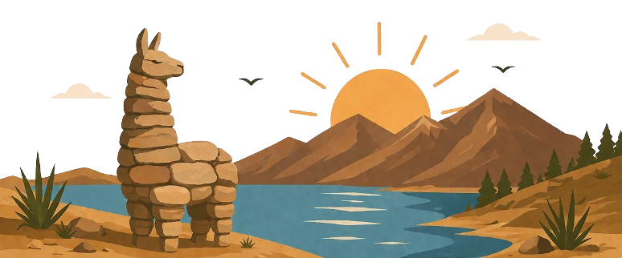

  

# Tierra de Recuerdos:  

## Sobre o Projeto
Projeto individual  acadêmico que propõe a criação de uma plataforma web voltada à valorização e divulgação de dois lugares pouco evidenciados da Bolívia:

- Puerto Acosta  
- Orurillo Grande  

A proposta é mostrar que a Bolívia vai além dos destinos turísticos mais conhecidos, valorizando história, cultura, paisagens, patrimônio e memórias pessoais relacionadas a esses lugares.

A solução combina conteúdo informativo e recursos interativos, utilizando questionários e dashboards para ampliar o envolvimento do usuário e promover conhecimento sobre esses lugares.

O projeto também busca unir tecnologia e identidade cultural por meio de interações, questionários e deashboards.

---

## Funcionalidades previstas

- Cadastro de usuários
- Quiz cultural interativo
- Dashboard com indicadores
- Conteúdos/Funcionalidades extras para usuários cadastrados

---

## Para o desenvolvimento esta sendo utilizado:
Front-end:
- HTML 
- CSS  
- JavaScript

Back-end: 
- Node.js  (API)

Banco de Dados:
- MySQL (MySQL Server)
---

## Objetivo

Promover valorização cultural, aprendizagem interativa e preservação da memória por meio da tecnologia.

---

##  Links do Projeto
[Ferramenta de Gestão -Trello](https://trello.com/invite/b/69f142055999f2b1feb1cf16/ATTIfbe89016fd4156397ddb18d0dbfad1eaA28368C3/gestao-tierra-de-recuerdos)

[Documentação](https://bandteccom-my.sharepoint.com/:w:/g/personal/marilyn_antinapa_sptech_school/IQDemjFSEmULSIyHXokoBBh9AR7ZPvV9wtOjtYalJ-VoxrU)

## Autor

Marilyn Gabriela Aquise Antinapa
Projeto Individual — Sistemas de Informação

✨ "La memoria mantiene viva la tierra donde nacieron nuestras raíces."
